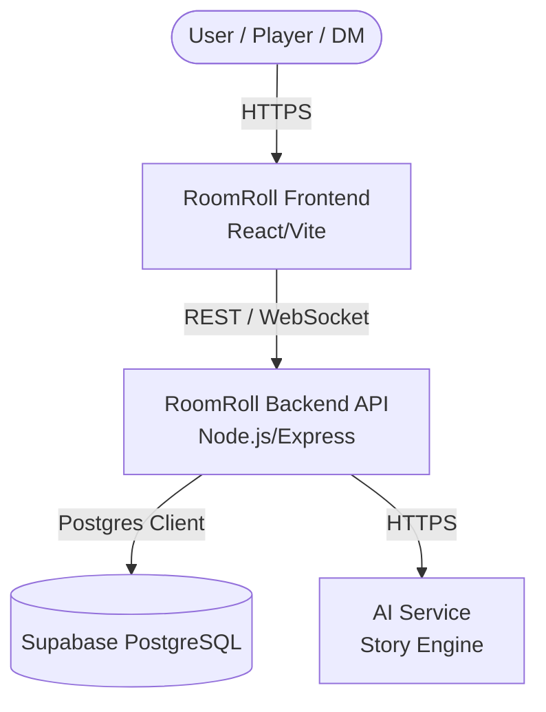
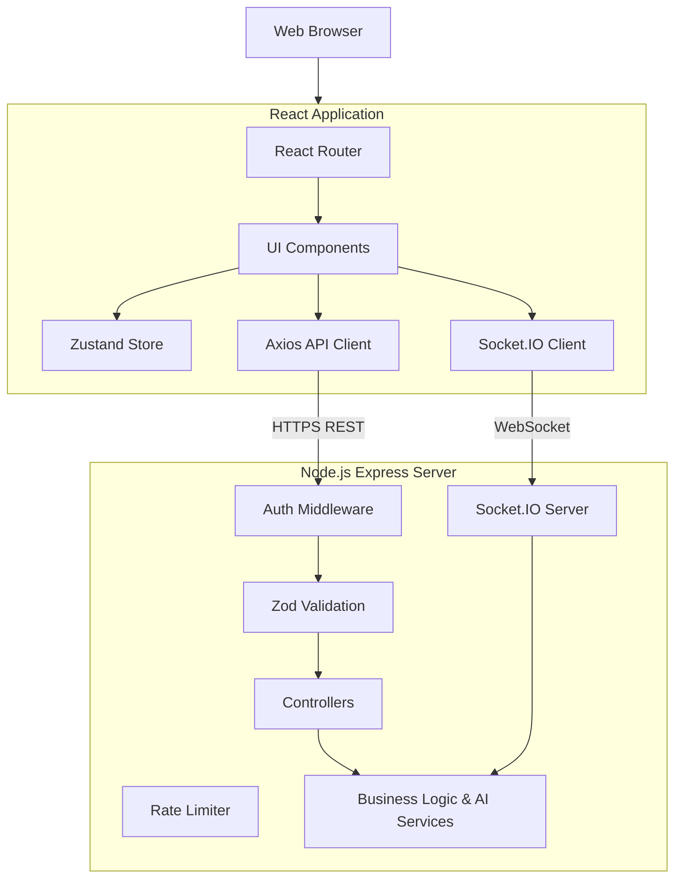
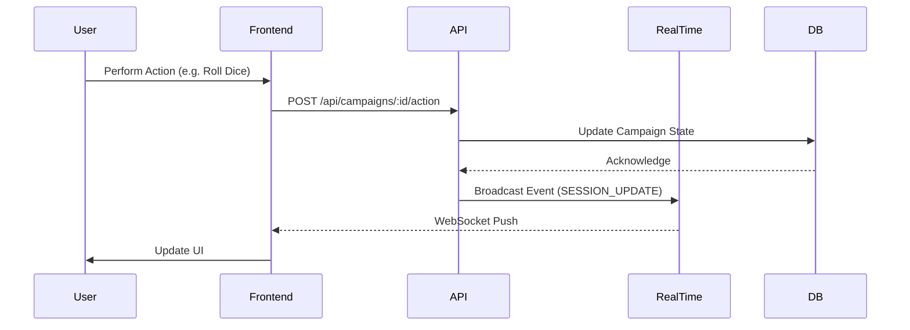

# RoomRoll Architecture

## Overview
RoomRoll is a tabletop roleplaying game (TTRPG) platform powered by real-time collaborative features and AI assistance. It consists of a React frontend and a Node.js/Express backend that communicates with a Supabase PostgreSQL database.

## System Context Diagram

## Container Architecture

## Components and Data Flow

### Frontend
- **Framework**: React with Vite.
- **Routing**: React Router handles navigation (e.g., `/campaigns/:id`, `/rooms/:id`).
- **State Management**: Zustand manages real-time and global state (`authStore.ts`, `roomStore.ts`, `useWorldStore.ts`).
- **Real-time Engine**: Socket.IO client for live session synchronization.
- **API Communication**: Configured Axios instance with token interceptors.

### Backend
- **Framework**: Node.js with Express.
- **API Structure**: Controllers orchestrate request handling while Services contain core business logic (e.g., `campaignService.ts`, `aiService.ts`, `tavernService.ts`).
- **Real-Time Integration**: Socket.IO integrated with Express, handling real-time synchronization in `registerRealtimeHandlers`.
- **Database Connection**: Direct PostgreSQL interaction through the Supabase client library using the service role key (bypassing RLS for server-side logic).
- **Background Tasks**: Includes a simple polling scheduler using `setInterval` (e.g., Weekly Chronicles email dispatch).

### Data Persistence (Supabase)
- **Supabase Postgres**: Used solely for relational data persistence. 
- **Security model**: While the backend uses a service role to bypass RLS, strict Row Level Security (RLS) policies are active at the database level for defense-in-depth in case of direct access configurations.

## Flow Diagrams

### Campaign Interaction Flow

