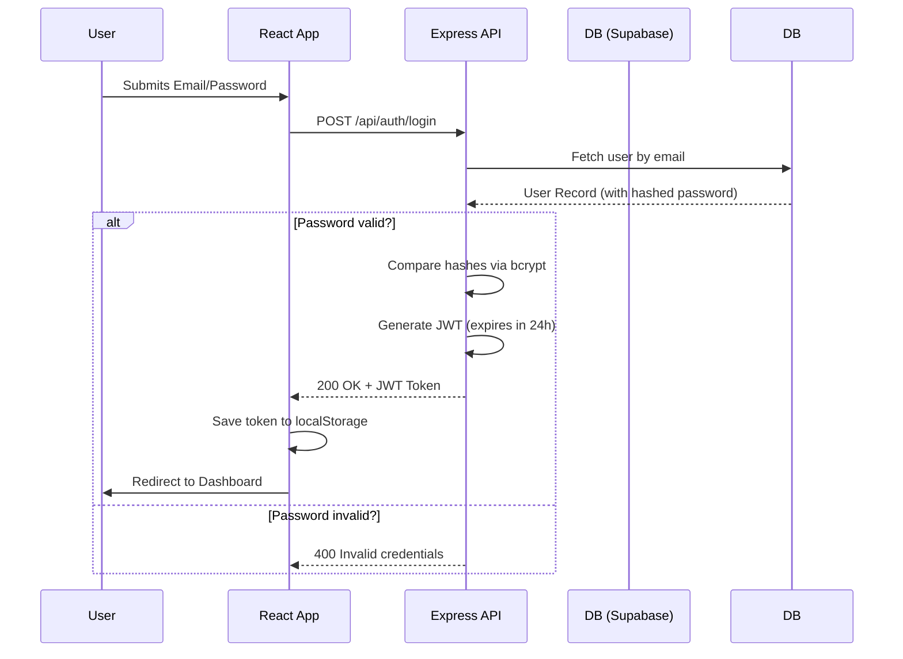

# Authentication Flow

RoomRoll utilizes a custom JWT (JSON Web Token) authentication system built on top of Express and PostgreSQL, managing its own `users` table rather than relying on Supabase Auth.

## Overview
1. Passwords are mathematically hashed using `bcrypt` (10 salt rounds).
2. Sessions are maintained via signed JWT tokens passed via the `Authorization: Bearer <token>` header.
3. The frontend persists tokens in `localStorage`.

## Auth Sequence Diagram

### Login / Signup Flow

## Session Handling & Protected Routes

### Frontend 
The `api.ts` Axios instance includes interceptors:
- **Request Interceptor**: Extracts the `roomroll_token` from `localStorage` and appends it to outgoing requests.
- **Response Interceptor**: Listens for HTTP 401 Unauthorized responses (specifically errors like `TokenExpiredError` or `JsonWebTokenError`). Upon receiving one, it clears `localStorage` to purge the invalid session, forcing the user to log back in.

### Backend
The backend utilizes the `authenticateRequest` middleware (`authMiddleware.ts`):
1. Reads `req.headers.authorization`.
2. Verifies the token using `jsonwebtoken` and `process.env.JWT_SECRET`.
3. If valid, attaches the decoded payload (containing `id`, `email`, and `role`) to `req.user`.
4. If invalid, missing, or expired, halts the request and returns `401 Unauthorized`.

All application-specific routes (Campaigns, Rooms, Story Prep) are guarded by `authenticateRequest`.
