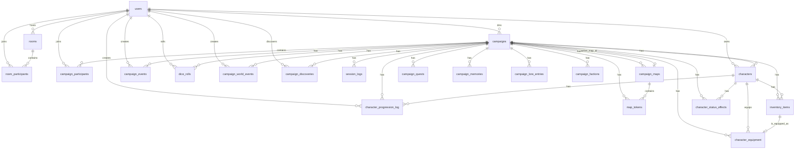

# RoomRoll Database Documentation

This document provides a comprehensive overview of the RoomRoll PostgreSQL database schema, including tables, relationships, indexes, constraints, and Row Level Security (RLS) policies.

## Entity-Relationship Diagram

## Tables & Schemas

### Core Authentication & Users
#### `users`
* **Primary Key**: `id` (SERIAL)
* **Columns**:
  * `display_name` (VARCHAR)
  * `email` (VARCHAR, UNIQUE)
  * `password_hash` (VARCHAR)
  * `created_at` (TIMESTAMPTZ)
  * `updated_at` (TIMESTAMPTZ)

#### `rooms`
* **Primary Key**: `id` (SERIAL)
* **Foreign Keys**: `host_id` -> `users(id)` ON DELETE CASCADE
* **Columns**:
  * `name` (VARCHAR)
  * `invite_code` (VARCHAR, UNIQUE)
  * `created_at` (TIMESTAMPTZ)

#### `room_participants`
* **Primary Key**: `(room_id, user_id)`
* **Foreign Keys**: 
  * `room_id` -> `rooms(id)` ON DELETE CASCADE
  * `user_id` -> `users(id)` ON DELETE CASCADE
* **Columns**:
  * `joined_at` (TIMESTAMPTZ)

### Campaign Management
#### `campaigns`
* **Primary Key**: `id` (SERIAL)
* **Foreign Keys**: 
  * `dm_user_id` -> `users(id)` ON DELETE CASCADE
  * `active_map_id` -> `campaign_maps(id)` ON DELETE SET NULL
* **Columns**:
  * `name` (VARCHAR)
  * `description` (TEXT)
  * `world_type` (VARCHAR)
  * `invite_code` (VARCHAR, UNIQUE)
  * `current_session_state` (JSONB)
  * `last_played_at` (TIMESTAMPTZ)
  * `created_at` (TIMESTAMPTZ)

#### `campaign_participants`
* **Primary Key**: `id` (SERIAL)
* **Foreign Keys**: 
  * `campaign_id` -> `campaigns(id)` ON DELETE CASCADE
  * `user_id` -> `users(id)` ON DELETE CASCADE
* **Constraints**: 
  * UNIQUE `(campaign_id, user_id)`
  * CHECK `role IN ('DM', 'player')`
* **Columns**:
  * `role` (VARCHAR)
  * `joined_at` (TIMESTAMPTZ)

### Characters & Inventory
#### `characters`
* **Primary Key**: `id` (SERIAL)
* **Foreign Keys**: 
  * `campaign_id` -> `campaigns(id)` ON DELETE CASCADE
  * `user_id` -> `users(id)` ON DELETE CASCADE
* **Constraints**: CHECK `level >= 1`, CHECK `xp >= 0`
* **Indexes**: `idx_characters_campaign_id`, `idx_characters_user_id`
* **Columns**:
  * `name`, `class_name`, `species`, `background`, `backstory`
  * `is_npc` (BOOLEAN)
  * `level`, `xp` (INTEGER)
  * `ability_scores`, `combat_stats`, `progression_state`, `currency` (JSONB)
  * `notes` (TEXT)
  * `created_at`, `updated_at` (TIMESTAMPTZ)

#### `inventory_items`
* **Primary Key**: `id` (SERIAL)
* **Foreign Keys**: `campaign_id` -> `campaigns(id)`, `character_id` -> `characters(id)`
* **Constraints**: CHECK `item_type IN (...)`, CHECK `quantity >= 0`
* **Indexes**: `idx_inventory_items_character_id`, `idx_inventory_items_campaign_id`
* **Columns**:
  * `name`, `description`, `item_type`, `rarity`
  * `quantity` (INTEGER), `weight` (NUMERIC)
  * `stackable`, `equippable` (BOOLEAN)
  * `item_data` (JSONB)
  * `created_at`, `updated_at` (TIMESTAMPTZ)

#### `character_equipment`
* **Primary Key**: `id` (SERIAL)
* **Foreign Keys**: `campaign_id` -> `campaigns(id)`, `character_id` -> `characters(id)`, `inventory_item_id` -> `inventory_items(id)`
* **Constraints**: 
  * UNIQUE `(character_id, slot)`
  * UNIQUE `(inventory_item_id)`
  * CHECK `slot IN (...)`
* **Indexes**: `idx_character_equipment_character_id`
* **Columns**:
  * `slot` (VARCHAR)
  * `equipped_at` (TIMESTAMPTZ)

#### `character_status_effects`
* **Primary Key**: `id` (SERIAL)
* **Foreign Keys**: `campaign_id` -> `campaigns(id)`, `character_id` -> `characters(id)`
* **Constraints**: CHECK `effect_type IN (...)`, CHECK `duration_type IN (...)`
* **Indexes**: `idx_character_status_effects_character_id`, `idx_character_status_effects_campaign_id`
* **Columns**:
  * `name`, `effect_type`, `source`, `duration_type`
  * `duration_value`, `remaining_duration` (INTEGER)
  * `modifiers` (JSONB), `is_active` (BOOLEAN)
  * `applied_at`, `expires_at`, `removed_at` (TIMESTAMPTZ)

#### `character_progression_log`
* **Primary Key**: `id` (SERIAL)
* **Foreign Keys**: `campaign_id` -> `campaigns(id)`, `character_id` -> `characters(id)`, `created_by` -> `users(id)`
* **Constraints**: CHECK `change_type IN (...)`
* **Indexes**: `idx_character_progression_log_character_id`, `idx_character_progression_log_campaign_id`
* **Columns**:
  * `change_type` (VARCHAR)
  * `amount`, `previous_xp`, `new_xp`, `previous_level`, `new_level` (INTEGER)
  * `reason` (TEXT), `metadata` (JSONB)
  * `created_at` (TIMESTAMPTZ)

### Session & Gameplay
#### `session_logs`
* **Primary Key**: `id` (SERIAL)
* **Foreign Keys**: `campaign_id` -> `campaigns(id)` ON DELETE CASCADE
* **Indexes**: `idx_session_logs_session_id`, `idx_session_logs_created_at`
* **Columns**:
  * `session_summary` (TEXT)
  * `narration_log`, `session_snapshot` (JSONB)
  * `session_id`, `room_id` (VARCHAR)
  * `created_at` (TIMESTAMPTZ)

#### `campaign_events`
* **Primary Key**: `id` (SERIAL)
* **Foreign Keys**: `campaign_id` -> `campaigns(id)`, `created_by` -> `users(id)`
* **Indexes**: `idx_campaign_events_session_id`
* **Columns**:
  * `event_type` (VARCHAR)
  * `content` (JSONB)
  * `session_id`, `room_id` (VARCHAR)
  * `created_at` (TIMESTAMPTZ)

#### `dice_rolls`
* **Primary Key**: `id` (SERIAL)
* **Foreign Keys**: `campaign_id` -> `campaigns(id)`, `user_id` -> `users(id)`
* **Indexes**: `idx_dice_rolls_session_id`, `idx_dice_rolls_classification_tier`
* **Columns**:
  * `dice_type` (VARCHAR), `rolls` (JSONB)
  * `result`, `modifier`, `total` (INTEGER)
  * `advantage_state` (VARCHAR), `context` (TEXT)
  * `classification` (JSONB), `narration` (TEXT) - *Cinematic Dice System*
  * `session_id`, `room_id` (VARCHAR)
  * `created_at` (TIMESTAMPTZ)

#### `campaign_maps`
* **Primary Key**: `id` (SERIAL)
* **Foreign Keys**: `campaign_id` -> `campaigns(id)`
* **Columns**:
  * `name`, `image_url` (TEXT)
  * `grid_enabled` (BOOLEAN), `grid_size` (INTEGER)
  * `reveal_state` (JSONB), `is_active` (BOOLEAN)
  * `created_at` (TIMESTAMPTZ)

#### `map_tokens`
* **Primary Key**: `id` (SERIAL)
* **Foreign Keys**: `campaign_id` -> `campaigns(id)`, `map_id` -> `campaign_maps(id)`
* **Constraints**: CHECK `token_type IN (...)`
* **Indexes**: `idx_map_tokens_session_id`
* **Columns**:
  * `token_type`, `label`
  * `hp_current`, `hp_max` (INTEGER)
  * `position` (JSONB), `is_hidden` (BOOLEAN)
  * `session_id`, `room_id` (VARCHAR)
  * `created_at`, `updated_at` (TIMESTAMPTZ)

### Lore & Story
#### `campaign_world_events`
* **Primary Key**: `id` (SERIAL)
* **Foreign Keys**: `campaign_id` -> `campaigns(id)`, `created_by` -> `users(id)`
* **Indexes**: `idx_campaign_world_events_session_id`
* **Columns**:
  * `title`, `description`, `status`
  * `session_id`, `room_id` (VARCHAR)
  * `created_at` (TIMESTAMPTZ)

#### `campaign_quests`
* **Primary Key**: `id` (SERIAL)
* **Foreign Keys**: `campaign_id` -> `campaigns(id)`
* **Indexes**: `idx_campaign_quests_session_id`
* **Columns**:
  * `title`, `description`, `status`, `progress` (JSONB)
  * `session_id`, `room_id` (VARCHAR)
  * `created_at`, `updated_at` (TIMESTAMPTZ)

#### `campaign_memories`
* **Primary Key**: `id` (SERIAL)
* **Foreign Keys**: `campaign_id` -> `campaigns(id)`
* **Indexes**: `idx_campaign_memories_session_id`, `idx_campaign_memories_is_emotional_moment`
* **Columns**:
  * `summary`, `key_facts` (JSONB)
  * `is_emotional_moment` (BOOLEAN), `moment_type` (VARCHAR) - *Memory Moments System*
  * `session_id`, `room_id` (VARCHAR)
  * `created_at`, `updated_at` (TIMESTAMPTZ)

#### `campaign_lore_entries`
* **Primary Key**: `id` (SERIAL)
* **Foreign Keys**: `campaign_id` -> `campaigns(id)`
* **Columns**:
  * `title`, `category`, `content` (TEXT)
  * `is_secret`, `is_discovered` (BOOLEAN)
  * `created_at`, `updated_at` (TIMESTAMPTZ)

#### `campaign_factions`
* **Primary Key**: `id` (SERIAL)
* **Foreign Keys**: `campaign_id` -> `campaigns(id)`
* **Columns**:
  * `name`, `description`, `leader`
  * `relationships` (JSONB), `is_discovered` (BOOLEAN)
  * `created_at`, `updated_at` (TIMESTAMPTZ)

#### `campaign_discoveries`
* **Primary Key**: `id` (SERIAL)
* **Foreign Keys**: `campaign_id` -> `campaigns(id)`, `discovered_by` -> `users(id)`
* **Constraints**: CHECK `entity_type IN ('lore', 'faction', 'event')`
* **Columns**:
  * `entity_type` (VARCHAR)
  * `entity_id` (INTEGER)
  * `discovered_at` (TIMESTAMPTZ)

## Data Ownership & RLS Policies

RoomRoll utilizes PostgreSQL Row Level Security (RLS) to enforce tenant isolation (per campaign) and strict ownership checks. 
The system extracts user IDs from custom JWT claims using a `jwt_user_id()` function.

### Access Control Architecture
Two Security Definer functions resolve access control without causing infinite recursion in PostgreSQL:
* `is_campaign_member(camp_id)` - Returns `true` if the current JWT user is in `campaign_participants` for the given campaign.
* `is_campaign_dm(camp_id)` - Returns `true` if the current JWT user is the `dm_user_id` of the given campaign.

### RLS Policies
* **`campaigns`**: 
  * **SELECT**: Visible to the DM or any active campaign participant.
  * **INSERT/UPDATE/DELETE**: Restricted strictly to the DM (`jwt_user_id() = dm_user_id`).
* **`campaign_participants`**: 
  * **SELECT/DELETE**: Restricted to the user themselves or the DM of the campaign.
  * **INSERT**: Restricted to the user themselves.
* **`characters`**: 
  * **SELECT**: Visible to any member or the DM of the campaign.
  * **INSERT/UPDATE/DELETE**: Restricted to the character owner (`user_id`) or the DM.
* **Campaign-Scoped Data** (`campaign_events`, `session_logs`, `campaign_maps`, `map_tokens`, `dice_rolls`, `campaign_world_events`, `campaign_quests`, `campaign_memories`):
  * **SELECT**: Visible to any active campaign participant (via `is_campaign_member()`). Write access is generally deferred to backend validation assuming bypass of RLS via `service_role`.
